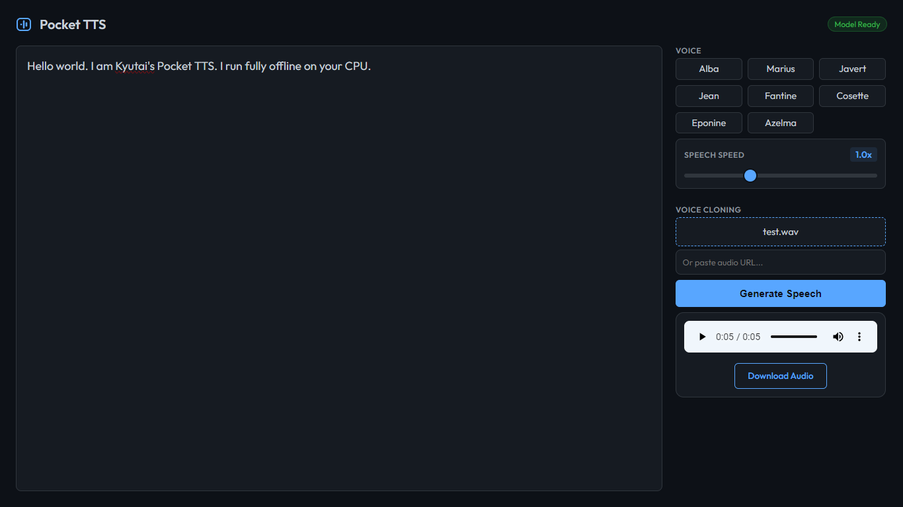

# Pocket TTS Web UI

A modern, offline-capable Web UI for [Kyutai's Pocket TTS](https://github.com/kyutai-labs/pocket-tts). This application allows you to generate high-quality text-to-speech completely locally on your CPU.



## Features

*   **Fully Offline**: Runs entirely on your local machine after downloading models.
*   **Modern UI**: Sleek, dark-mode interface with responsive design.
*   **Real-time Streaming**: Listen to audio as it's being generated.
*   **Speech Speed Control**: Adjust playback speed from 0.5x to 2.0x.
*   **Advanced Controls**: Customize generation with Temperature and LSD Step settings.
*   **Voice Cloning**: Clone voices from any audio file (requires restricted model).
*   **Cross-Platform**: Scripts included for Windows, Linux, and macOS.

## Prerequisites

*   Python 3.10+
*   Git


## Installation

### Using Virtual Environment (Recommended)

**Windows:**
Run the setup script to automatically create a virtual environment (`venv`) and install dependencies:
```cmd
setup_env.bat
```

**Linux / macOS:**
```bash
chmod +x setup_env.sh
./setup_env.sh
```

### Manual Installation
1.  **Clone the repository**:
    ```bash
    git clone https://github.com/your-username/pocket-tts-web-ui.git
    cd pocket-tts-web-ui
    ```

2.  **Create and Activate venv (Optional but recommended)**:
    *   Windows: `python -m venv venv` then `venv\Scripts\activate`
    *   Linux/Mac: `python3 -m venv venv` then `source venv/bin/activate`

3.  **Install dependencies**:
    ```bash
    pip install -r requirements.txt
    ```

## Setup (Models)

To run offline, you need to download the model weights first.

**Windows:**
Double-click `download_models.bat` or run:
```cmd
download_models.bat
```

**Linux / macOS:**
Run the shell script:
```bash
chmod +x download_models.sh
./download_models.sh
```

### Voice Cloning Setup (Optional)
To use the voice cloning feature, you need access to the restricted `kyutai/pocket-tts` model on Hugging Face.

1.  **Hugging Face Account**: creating a [Hugging Face account](https://huggingface.co/join) if you don't have one.
2.  **Accept Terms**: Visit the [Pocket TTS model page](https://huggingface.co/kyutai/pocket-tts) and accept the license terms.
3.  **Access Token**: Go to your [Settings > Access Tokens](https://huggingface.co/settings/tokens) and create a new token (Read permission is sufficient).
4.  **Login via CLI**:
    Make sure you have installed the project dependencies (which include `huggingface_hub`).
    *   **Windows**:
        ```cmd
        venv\Scripts\activate
        huggingface-cli login
        ```
    *   **Linux / macOS**:
        ```bash
        source venv/bin/activate
        huggingface-cli login
        ```
    Paste your access token when prompted.
5.  **Download Models**:
    Run the download script again (`download_models.bat` or `./download_models.sh`). It will now detect your login and download the restricted `tts_b6369a24.safetensors`.

> **Note**: If you skip these steps, the application will still work using the default model, but the "Voice Cloning" feature will be disabled or use a fallback mechanism.

## Usage

**Windows:**
Double-click `run_app.bat` or run:
```cmd
run_app.bat
```

**Linux / macOS:**
Run the shell script:
```bash
chmod +x run_app.sh
./run_app.sh
```

Open your browser and navigate to: **[http://localhost:8000](http://localhost:8000)**

### Using Voice Cloning
1.  Ensure you have completed the **Voice Cloning Setup** above.
2.  In the Web UI, look for the "Voice Cloning" section.
3.  Upload a short audio file (WAV/MP3) of the voice you want to clone (approx 3-10 seconds is usually sufficient), OR paste a direct URL to an audio file.
4.  Enter your text and click 'Generate Speech'.
5.  The system will synthesize the speech matching the tone and characteristics of the uploaded audio.

## Project Structure

*   `app.py`: FastAPI backend server.
*   `static/`: Frontend assets (HTML, CSS, JS).
*   `models/`: Directory where models are downloaded.
*   `pocket-tts-src/`: Local copy of the Pocket TTS library.
*   `setup_offline_models.py`: Script to fetch models from Hugging Face.

## License

This project wraps [Pocket TTS](https://github.com/kyutai-labs/pocket-tts). Please refer to their repository for license details regarding the core library and model weights.
